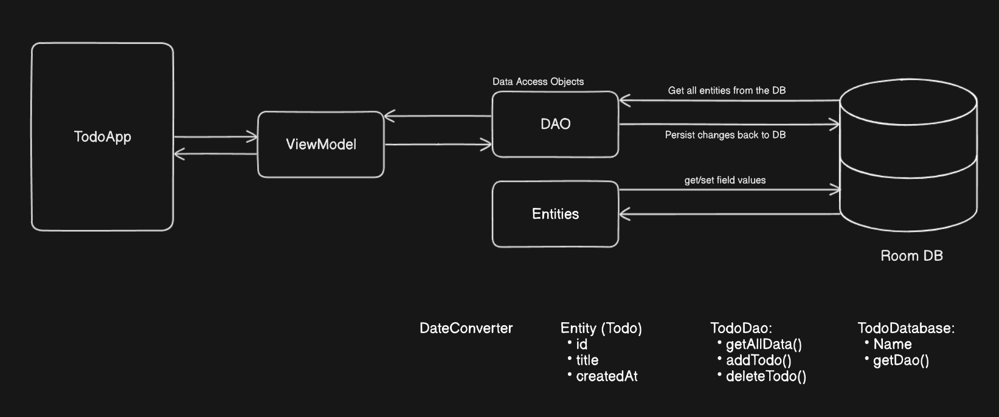

# Todo app com Room DB

### Salvando em memória

<div align='center'>
    
</div>

### Salvando no SQLite DB com Room

<div align='center'>
    
</div>

### Configuração do Room DB

* Adicionando dependencias:

```
# build.gradle.kts (Module :app)

plugins {
    ...
    id("kotlin-kapt")
}

...

dependencies {
    ...
    
    // Room DB
    val room_version = "2.6.1"

    implementation("androidx.room:room-runtime:$room_version")
    annotationProcessor("androidx.room:room-compiler:$room_version")

    // To use Kotlin annotation processing tool (kapt)
    kapt("androidx.room:room-compiler:$room_version")
}

```

* Criar classe `MainApplication`

```kotlin
class MainApplication: Application() {
    companion object {
        lateinit var todoDatabase: TodoDatabase
    }

    override fun onCreate() {
        super.onCreate()
        todoDatabase = Room.databaseBuilder(
            applicationContext,
            TodoDatabase::class.java,
            TodoDatabase.NAME
        ).build()
    }
}
```

* Adicionar ao `AndroidManifest`

```
# manifests/AndroidManifest.xml

<?xml version="1.0" encoding="utf-8"?>
<manifest xmlns:android="http://schemas.android.com/apk/res/android"
    xmlns:tools="http://schemas.android.com/tools">

    <application
        ...
        android:name=".MainApplication"
        ...
    </application>
</manifest>
```